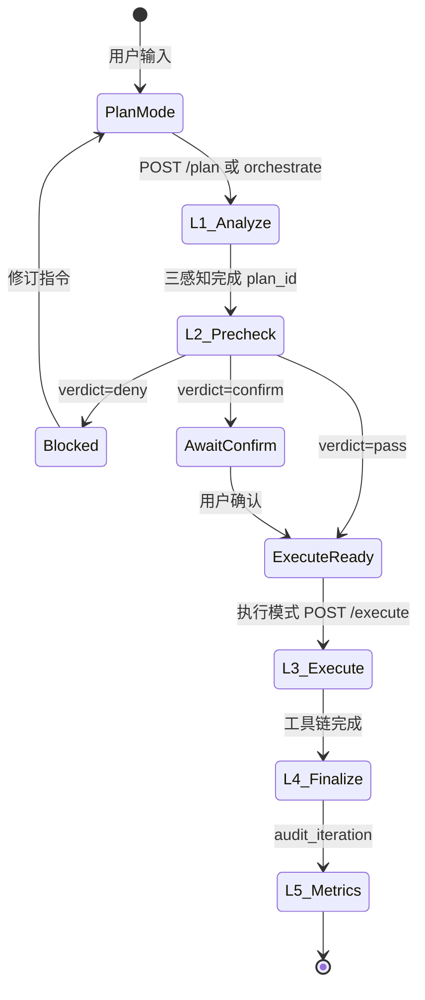

# 多角色协调手册 — 用户 · 运维 · 开发

> **版本**：v1.0 · **对齐**：`FINAL_ARCHITECTURE.md` v1.0-final  
> **目的**：从三类参与者视角，协调 **前端模块 ↔ 三 Agent ↔ 五层流水线 ↔ 数据实体**，雕琢工作流与数据逻辑。

---

## 一、全景架构图

```text
┌─────────────────────────────────────────────────────────────────────────────┐
│  参与者                                                                      │
│  👤 用户（业务指令）  🔧 运维（监控/告警/Trace）  💻 开发（扩展/API/工具）      │
└───────────────────────────────────┬─────────────────────────────────────────┘
                                    │
┌───────────────────────────────────▼─────────────────────────────────────────┐
│  前端（Vue3 · Pinia · Element Plus）                                         │
│  AgentChat 主编排 · 计划/执行双模式 · OrchestratorPipeline · PersonaCoordPanel│
│  Dashboard / Alerts / TraceView / WorkflowView（运维视图）                    │
└───────────────────────────────────┬─────────────────────────────────────────┘
                                    │ REST + WS
┌───────────────────────────────────▼─────────────────────────────────────────┐
│  API 层  security_agent/api/routes/agent_routes.py                          │
│  /plan · /l2/precheck · /execute · /orchestrate · /registry                 │
│  /chat（遗留 bypass — 仅调试，生产禁用）                                       │
└───────────────────────────────────┬─────────────────────────────────────────┘
                                    │
         ┌──────────────────────────┼──────────────────────────┐
         ▼                          ▼                          ▼
┌─────────────────┐       ┌─────────────────┐       ┌─────────────────┐
│ core_dispatch   │ gate  │ safety_sandbox  │ gate  │ audit_iteration │
│ L1 analyze      │──────▶│ L2 precheck     │──────▶│ L4 finalize     │
│ L3 execute      │       │ 零执行零决策     │       │ L5 metrics      │
└────────┬────────┘       └────────┬────────┘       └────────┬────────┘
         │                         │                         │
         └─────────────────────────┼─────────────────────────┘
                                   ▼
┌─────────────────────────────────────────────────────────────────────────────┐
│  数据层                                                                      │
│  plans.db (plan_id) · traces.db (trace_id stages) · audit.jsonl (append)    │
│  Gitee Wiki（边界对抗 / 知识索引 / 感知快照 / 回流 — 目标态）                   │
└─────────────────────────────────────────────────────────────────────────────┘
```

---

## 二、核心数据实体与 ID 契约

| 实体 | 生成时机 | 作用域 | 存储 | 关联 |
|------|----------|--------|------|------|
| `plan_id` | L1 analyze 完成 | 单条指令 | `data/plans.db` + 内存缓存 | 1 plan → 1 trace |
| `trace_id` | L1 与 plan 同时创建 | 全链路 | `traces.db` stages | L1–L5 同一 ID |
| `batch_id` | 批量入队 | 多条 plan 共享 | plan.batch_id | 每条独立 trace |
| `session_id` | 前端会话 | 对话上下文 | 前端 / brain | 非审计主键 |

**ID 规则**（`pipeline/trace_id.py`）：

- `trace_id` 统一前缀 `trace-`，L3 execute 必须继承 L1 的 trace，禁止分叉。
- 运维导出事件包时以 `trace_id` 为唯一索引键。

---

## 三、流水线状态机



| 阶段 | phase_lock | 允许操作 | 禁止 |
|------|------------|----------|------|
| L1 | `L1_only` | 三感知、意图、静态绘图 | 工具、MCP、写操作 |
| L2 | — | 护栏、预演、verdict | 执行、决策 |
| L3 | `execute` | brain.chat(plan=…)、工具簇 | 跳过 L2 |
| L4/L5 | — | 审计 append、trace 完成、指标 | 修改历史审计 |

---

## 四、👤 用户视角 — 工作流与 UI 组件

### 4.1 典型旅程

1. **计划模式** — 输入自然语言指令 → 点击「L1 分析」
2. **审阅三感知** — `PlanPanel` 展示：
   - 抗性边界（越界/权限跃迁探针）
   - 知识检索引用
   - 静态环境快照（CPU/端口/磁盘等）
3. **切换执行模式** — 若 L2 通过（或确认高危操作）→ 「L3 执行」
4. **查看结果** — `ExecutePanel` + `AuditPanel` → 跳转 `TraceView`

### 4.2 用户可见组件映射

| 组件 | 用户感知 | 后端阶段 |
|------|----------|----------|
| 计划/执行 Segmented | 模式切换 | mode → API 分支 |
| `OrchestratorPipeline` | 三 Agent 进度灯 | agentStages |
| `PlanPanel` | 「分析好了，能不能做」 | L1 triple_perception |
| 执行模式 Banner | L2 未过则锁定 | canExecute |
| `ExecutePanel` | 工具调用结果 | L3 execute_result |
| `AuditPanel` | 审计摘要 | L4 finalize |
| `BatchQueue` | 批量排队（每条全流程） | batch_id |

### 4.3 用户数据逻辑

```text
输入 message
  → build_analysis_plan → plan { plan_id, trace_id, triple_perception, requires_confirm }
  → 前端 agentStore.currentPlan
  → orchestrate(auto_execute?) → l2Result → lastExecute → lastAudit
  → 消息流展示 plan_id / trace_id 标签
```

**用户须知**：

- 批量任务 **不会** 跳过 L1；每条独立 trace。
- 高危操作需二次确认（`requires_confirm` + L2 `confirm`）。
- 勿使用遗留 `/chat` 入口（无 L2 闸门）。

---

## 五、🔧 运维视角 — 监控、溯源、批处理

### 5.1 典型旅程

1. **Dashboard** — 全局健康、告警趋势、Agent 活动概览
2. **Alerts** — 规则命中 → 关联 `trace_id` 下钻
3. **TraceView** — 按 `trace_id` 查看 L1→L5 stage 时间线
4. **Safety / Audit** — `GET /api/audit/logs` → append-only JSONL
5. **批量队列** — AgentChat 侧栏 `BatchQueue` 状态：queued → analyzing → executing → auditing

### 5.2 运维模块协调

| 模块 | 数据源 | 协调点 |
|------|--------|--------|
| TraceView | `TraceStorage` stages | 与 plan.trace_id 一致 |
| Dashboard 指标 | L5 metrics_snapshot | audit_iteration.finalize |
| 告警关联 | alert.rule + trace | 导出时用 trace_id |
| Wiki 同步 | gitee wiki read | 回流 pending（P1） |

### 5.3 运维操作清单

| 场景 | 动作 | API / 路径 |
|------|------|------------|
|  incident 复盘 | 按 trace 导出 stage | TraceView + audit.jsonl |
| L2 拒绝排查 | 查 boundary_hits | plan.triple_perception |
| 执行失败 | 查 L3 stage + brain 降级 | execute_result.degradation_level |
| 服务重启后 plan 丢失 | 验证 plans.db | GET plan by plan_id |
| 非法 bypass 检测 | 搜 audit 无 L1 的 execute | 禁用 /chat 生产路由 |

### 5.4 运维数据流

```text
record_l1_analyze  → traces.db stage L1_*
record_l2_precheck → stage L2_safety_sandbox + audit pipeline_L2
record_l3_execute  → stage L3_execute_start
record_l4_finalize → stage L4_audit_finalize + complete_trace
audit.append_audit → data/audit.jsonl（全层事件）
```

---

## 六、💻 开发视角 — 模块地图与扩展点

### 6.1 后端模块地图

| 路径 | 职责 | 扩展方式 |
|------|------|----------|
| `agent/l1_triple_perception.py` | L1 三感知并行 | 新增感知模块 + PlanPanel 卡片 |
| `agent/core_agents.py` | 三 Agent 门面 | analyze/execute/finalize |
| `api/agent_plan.py` | 计划仓 + 闸门 | build_plan / run_l2 / run_execute |
| `pipeline/coordination.py` | trace stage 写入 | 新 stage 类型 |
| `storage/plan_store.py` | SQLite 持久化 | 迁移 schema |
| `tools/registry.py` + `cluster_map.py` | 工具 + 四簇 | 新工具注册 cluster |
| `audit/log.py` | append-only | get_audit_logs 别名 |

### 6.2 API 契约（开发集成）

| 方法 | 路径 | 请求 | 响应要点 |
|------|------|------|----------|
| POST | `/api/agent/plan` | `{ message, batch_id? }` | `plan_id`, `trace_id`, `triple_perception` |
| POST | `/api/agent/l2/precheck` | `{ plan_id }` | `verdict`: pass\|confirm\|deny |
| POST | `/api/agent/execute` | `{ plan_id, confirmed? }` | `trace_id`, `tools_used` |
| POST | `/api/agent/orchestrate` | `{ message, auto_execute?, batch_id? }` | plan + l2 + execute + audit 聚合 |
| GET | `/api/agent/registry` | — | agents, tool_clusters, pipeline_layers |

### 6.3 前端扩展点

| 文件 | 扩展 |
|------|------|
| `constants/agents.js` | Agent/Layer/Cluster 元数据 |
| `constants/pipeline.js` | 状态机、角色提示 |
| `stores/agent.js` | orchestrate / canExecute / batchQueue |
| `components/agent/*` | 各层面板 |
| `PersonaCoordPanel.vue` | 三角色上下文提示 |

### 6.4 开发约束（必守）

1. L1/L2 **不得** 调用 `TOOL_REGISTRY` 或 MCP
2. 新工具必须注册 `cluster`（metrics/logs/repair/schedule）
3. 任何写操作路径必须 `record_l3_execute_start` + 同一 `trace_id`
4. 审计仅 append，无 update/delete
5. 批量 API 必须 `build_analysis_plan` per item

---

## 七、三角色协作矩阵

| 工作项 | 用户 | 运维 | 开发 |
|--------|------|------|------|
| 提交指令 | ✅ 主责 | 代操/脚本 | API 集成 |
| L1 三感知审阅 | ✅ 确认语义 | 监控异常边界 | 调参/新探针 |
| L2 策略 | 确认高危 | 调护栏阈值 | 改 safety_sandbox |
| L3 执行 | 触发/确认 | 排障 trace | 工具/Flow |
| L4 审计 | 看摘要 | 卷宗/合规 | spine 格式 |
| L5 迭代 | — | 看 Dashboard | eval 权重 |
| Wiki 回流 | 受益 | 审核内容 | 实现 reflux API |
| 批量队列 | 提交 | 监控 backlog | batch_id 逻辑 |

---

## 八、组件雕琢清单（P0 已完成 / P1 待办）

| 组件 | 状态 | 三角色价值 |
|------|------|------------|
| plan_store SQLite | ✅ | 运维重启不丢 plan；开发可集成 |
| trace_id 归一 | ✅ | 运维单键溯源 |
| coordination stages | ✅ | TraceView 完整时间线 |
| tool cluster 元数据 | ✅ | 开发注册；用户见簇标签 |
| /chat bypass 警告 | ✅ | 运维识别非法路径 |
| PersonaCoordPanel | ✅ | 用户/运维/开发上下文提示 |
| Wiki reflux | ❌ P1 | 知识闭环 |
| WS stage 推送 | ⚠️ P1 | 运维实时 |
| WorkflowView 统一 | ⚠️ P1 | 避免双 UX |
| execute 重试 | ⚠️ P1 | 运维恢复 |

---

## 九、快速引用

```bash
# 用户路径：计划 → 编排
curl -X POST /api/agent/orchestrate -d '{"message":"查看系统状态"}'

# 运维：审计尾读
curl /api/audit/logs?limit=50

# 开发：注册表
curl /api/agent/registry
```

**权威文档链**：`FINAL_ARCHITECTURE.md` → 本文 → `FIVE_LAYER_PIPELINE.md` → `frontend/ARCHITECTURE.md`
